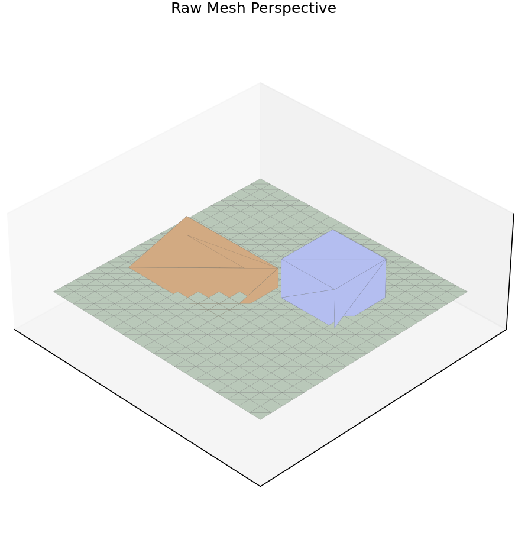
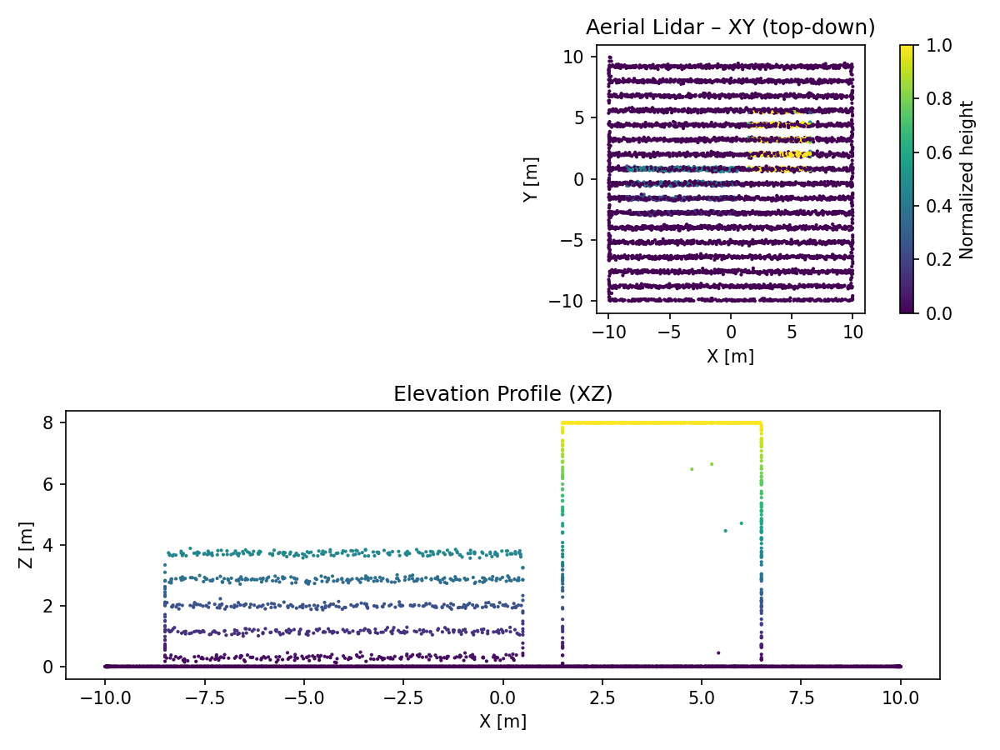
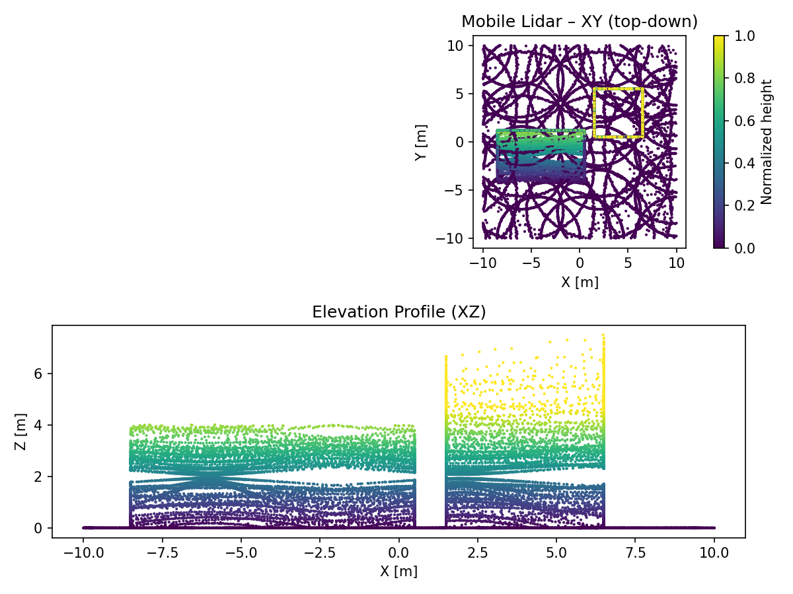

# Smesh – filthy-fast mesh→point cloud simulator

This is a minimal, type-annotated implementation of the **critical core components**
for the Smesh simulator:

- `MeshScene` (mesh IO + attribute probing via VTK)
- `Intersector` (VTK OBBTree + optional Embree via `trimesh[ray]`)
- `PointBatch` container
- `AttributeComputer` plug-ins (range, incidence, scan angle, returns, intensity, gps time, color/normal probe, beam footprint)
- `LasWriter` with **streaming** support and dynamic ExtraBytes
- `Sampler` orchestrator which glues everything together

## Installation

Smesh is available on PyPI:

```bash
pip install smesh
```

Optional extras expose faster intersectors and LAS compression:

```bash
pip install "smesh[vtk]"      # VTK-backed attribute probing & intersector
pip install "smesh[embree]"   # Embree (via trimesh[ray])
pip install "smesh[laz]"      # LAZ compression
```

Prefer to develop against the repo?

```bash
pip install -e .
```

### Installing straight from GitHub

To pull the latest main branch directly into a virtual environment:

```bash
pip install git+https://github.com/Chiark-Collective/smesh.git
```

For a reproducible install, pin to a tag (e.g., `git+https://github.com/Chiark-Collective/smesh.git@v0.1.0`).

## Quick taste

```python
import numpy as np
from smesh import MeshScene, Sampler, SamplerConfig, AutoIntersector, LasWriter
from smesh.core.intersector import RayBundle

scene = MeshScene(mesh_path="scene.ply")
# Make a tiny fan of rays from above
M = 1000
origins = np.tile(np.array([[0,0,10.0]]), (M,1))
dirs = np.tile(np.array([[0,0,-1.0]]), (M,1))
bundle = RayBundle(origins=origins, directions=dirs, max_range=100.0, multi_hit=False, meta={"gps_time": np.arange(M)*1e-3})

sampler = Sampler(scene, intersector=AutoIntersector(), cfg=SamplerConfig())
writer = LasWriter("out.las", compress=False)
stats = sampler.run_to_writer(writer, ray_batches=[bundle])
print(stats)
```

> Note: for VTK-backed attribute probing and fast VTK intersector, install `vtk`.
> For Embree, install `trimesh[ray]` which pulls `pyembree` (and requires Intel Embree runtime).

## Preview Gallery

Regenerate the lightweight preview assets (including a raw-mesh baseline) at any time:

```bash
python scripts/render_examples.py            # preview configs + raw mesh
python scripts/render_examples.py --full     # full-resolution configs
```

Outputs land in `examples/outputs/` and PNG composites in `examples/images/`.

## Workflow Examples

| Capture | Preview | Command |
| --- | --- | --- |
| Raw Mesh Baseline |  | `python scripts/render_examples.py --example raw_mesh` |
| Aerial LiDAR |  | `smesh sample examples/configs/preview/aerial_lidar_preview.yaml` |
| Mobile LiDAR |  | `smesh sample examples/configs/preview/mobile_lidar_preview.yaml` |
| Total Station |  | `smesh sample examples/configs/preview/total_station_preview.yaml` |
| Photogrammetry |  | `smesh sample examples/configs/preview/photogrammetry_preview.yaml` |

Each preview config runs in under a minute on CPU-only machines, producing lightweight outputs for quick inspection. Higher fidelity counterparts live in `examples/configs/` and can be regenerated by rerunning `scripts/render_examples.py --full`.

## One Scenario, Three Entry Points

The aerial preview (`examples/configs/preview/aerial_lidar_preview.yaml`) is reproduced below via config, pure CLI options, and the Python SDK.

**Config**

```bash
smesh sample examples/configs/preview/aerial_lidar_preview.yaml
```

**CLI arguments (no YAML)**

```bash
mkdir -p scratch
smesh sample-lidar --mesh examples/meshes/preview_scene.ply \
  --output scratch/aerial_cli.las --seed 101
```

**SDK**

```python
import numpy as np
from smesh import MeshScene, Sampler, SamplerConfig, LasWriter
from smesh.core.intersector import AutoIntersector
from smesh.motion.trajectory import LawnmowerTrajectory
from smesh.sensors.patterns import OscillatingMirrorPattern
from smesh.sensors.lidar import LidarSensor
from smesh.sensors.noise import LidarNoise

scene = MeshScene(mesh_path="examples/meshes/preview_scene.ply")
trajectory = LawnmowerTrajectory(scene, altitude_m=40.0, speed_mps=20.0, line_spacing_m=30.0)
pattern = OscillatingMirrorPattern(fov_deg=50.0, line_rate_hz=20.0, pulses_per_line=200)
noise = LidarNoise(sigma_range_m=0.05, sigma_angle_deg=0.1, keep_prob=0.99)
sensor = LidarSensor(pattern=pattern, trajectory=trajectory, noise=noise, max_range_m=200.0, multi_return=True)

sampler = Sampler(scene, intersector=AutoIntersector(), cfg=SamplerConfig(batch_size_rays=20000,
                                                                           attributes=["range","incidence","scan_angle","intensity","returns","gps_time"],
                                                                           beam_divergence_mrad=0.3))
rng = np.random.default_rng(101)
bundles = [batch.bundle for batch in sensor.batches(rng)]
writer = LasWriter("examples/outputs/aerial_sdk.las", compress=False)
sampler.run_to_writer(writer, bundles)
```

## Output writers

- `LasWriter` streams directly to disk batch-by-batch (compression optional).
- `PlyWriter` and `NpzWriter` buffer incoming batches in memory and emit a single file when `close()` is called. Call `close()` explicitly if you manage the writer yourself.

## Attribute pipeline notes

The sampler now orders attribute computers based on their declared dependencies. Custom attribute chains still work—dependencies like `range_m` for intensity will be inserted automatically so long as a matching producer exists.
