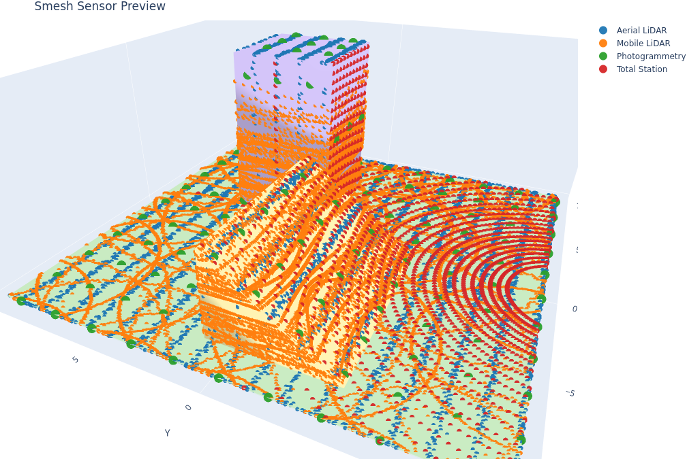

# SMesh – mesh→point cloud simulator



Sample points from a Mesh. *Smesh*.

Yeah, it wasn't my best day. But it sounds utterly filthy, which I enjoy.

- `MeshScene` (mesh IO + attribute probing via VTK)
- `Intersector` (VTK OBBTree + optional Embree via `trimesh[ray]`)
- `PointBatch` container
- `AttributeComputer` plug-ins (range, incidence, scan angle, returns, intensity, gps time, color/normal probe, beam footprint)
- `LasWriter` with **streaming** support and dynamic ExtraBytes
- `Sampler` orchestrator which glues everything together

## Installation

You wouldn't guess:

```bash
pip install smesh
```

Optional extras for faster intersectors and LAS compression:

```bash
pip install "smesh[vtk]"      # VTK-backed attribute probing & intersector
pip install "smesh[embree]"   # Embree (via trimesh[ray])
pip install "smesh[laz]"      # LAZ compression
```

## Workflow Examples

| Capture | Preview | Command |
| --- | --- | --- |
| Raw Mesh Baseline |  | `python scripts/render_examples.py --example raw_mesh` |
| Aerial LiDAR |  | `smesh sample examples/configs/preview/aerial_lidar_preview.yaml` |
| Mobile LiDAR |  | `smesh sample examples/configs/preview/mobile_lidar_preview.yaml` |
| Total Station |  | `smesh sample examples/configs/preview/total_station_preview.yaml` |
| Photogrammetry |  | `smesh sample examples/configs/preview/photogrammetry_preview.yaml` |

Each preview config runs in under a minute on CPU-only machines, producing lightweight outputs for quick inspection. 

Higher fidelity counterparts live in `examples/configs/` and can be regenerated by rerunning `scripts/render_examples.py --full`.

Want to help optimise it? Open a PR! See open [TODOs](/TODO.md).


## One Scenario, Three Entry Points

The aerial preview (`examples/configs/preview/aerial_lidar_preview.yaml`) is reproduced below via config, pure CLI options, and the Python SDK.

## Config file

```bash
smesh sample examples/configs/preview/aerial_lidar_preview.yaml
```

Does it all from a config file, which looks like:

```yaml
type: lidar
mesh:
  path: ../../meshes/preview_scene.ply
trajectory:
  kind: lawnmower
  altitude_m: 40.0
  speed_mps: 20.0
  line_spacing_m: 1.2
  heading_deg: 0.0
pattern:
  kind: oscillating
  fov_deg: 110.0
  line_rate_hz: 25.0
  pulses_per_line: 600
sensor:
  kind: lidar
  max_range_m: 200.0
  multi_return: true
  beam_divergence_mrad: 0.4
  num_lines: 60
noise:
  kind: lidar
  sigma_range_m: 0.05
  sigma_angle_deg: 0.1
  keep_prob: 0.99
sampler:
  batch_size_rays: 20000
attributes:
  - range
  - incidence
  - scan_angle
  - intensity
  - returns
  - gps_time
output:
  path: aerial_preview.las
  format: las
seed: 101
```

### CLI arguments (no YAML)

If you like passing around flags like a paid shill at a far-right rally, knock yourself out, but don't expect me to type them here:

```bash
mkdir -p scratch
smesh sample-lidar --mesh examples/meshes/preview_scene.ply \
  --output scratch/aerial_cli.las --seed 101
```

Use `--help` if you need to.

### Use SDK

If you're planning to smesh stuff from another project or smesh in a larger pipeline, you can use it like a library:

```python
import numpy as np
from smesh import MeshScene, Sampler, SamplerConfig, AutoIntersector, LasWriter
from smesh.core.intersector import RayBundle

scene = MeshScene(mesh_path="scene.ply")
# Make a tiny fan of rays from above
M = 1000
origins = np.tile(np.array([[0,0,10.0]]), (M,1))
dirs = np.tile(np.array([[0,0,-1.0]]), (M,1))
bundle = RayBundle(origins=origins, directions=dirs, max_range=100.0, multi_hit=False, meta={"gps_time": np.arange(M)*1e-3})

sampler = Sampler(scene, intersector=AutoIntersector(), cfg=SamplerConfig())
writer = LasWriter("out.las", compress=False)
stats = sampler.run_to_writer(writer, ray_batches=[bundle])
print(stats)
```

> Note: for VTK-backed attribute probing and fast VTK intersector, install `vtk`.
> For Embree, install `trimesh[ray]` which pulls `pyembree` (and requires Intel Embree runtime).


If you already have a YAML scenario, you can also run it directly from Python:

```python
from smesh.sdk import sample_from_config

result = sample_from_config("examples/configs/preview/aerial_lidar_preview.yaml")
print(result.output_path, result.stats["points"])
```

## Output writers

- `LasWriter` streams directly to disk batch-by-batch (compression optional).
- `PlyWriter` and `NpzWriter` buffer incoming batches in memory and emit a single file when `close()` is called. Call `close()` explicitly if you manage the writer yourself.

## Attribute pipeline notes

The sampler now orders attribute computers based on their declared dependencies. 
Custom attribute chains still work—dependencies like `range_m` for intensity will 
be inserted automatically so long as a matching producer exists.
