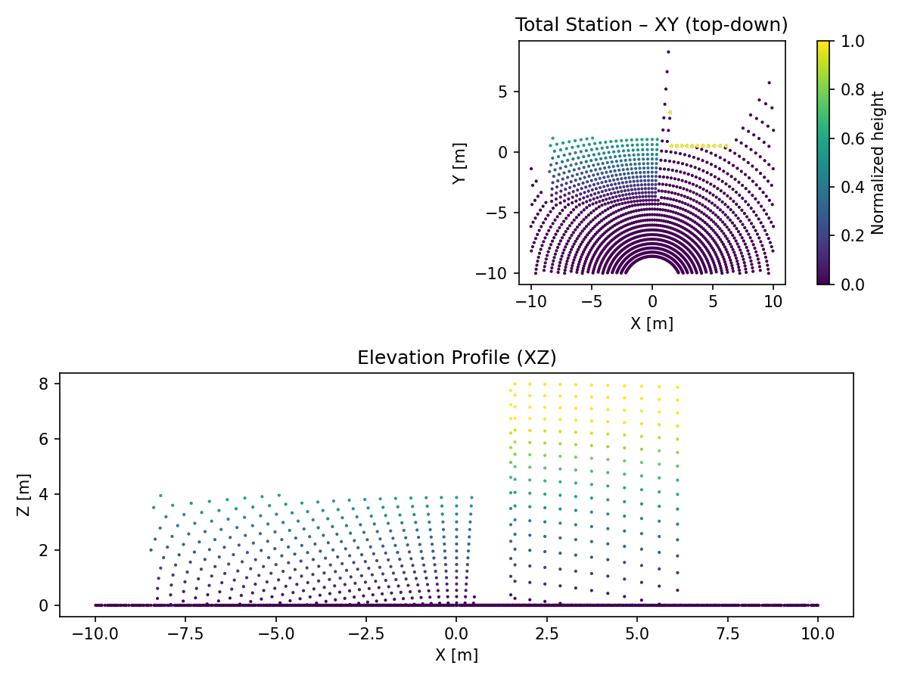

# Smesh – filthy-fast mesh→point cloud simulator

This is a minimal, type-annotated implementation of the **critical core components**
for the Smesh simulator:

- `MeshScene` (mesh IO + attribute probing via VTK)
- `Intersector` (VTK OBBTree + optional Embree via `trimesh[ray]`)
- `PointBatch` container
- `AttributeComputer` plug-ins (range, incidence, scan angle, returns, intensity, gps time, color/normal probe, beam footprint)
- `LasWriter` with **streaming** support and dynamic ExtraBytes
- `Sampler` orchestrator which glues everything together

## Quick taste

```python
import numpy as np
from smesh import MeshScene, Sampler, SamplerConfig, AutoIntersector, LasWriter
from smesh.core.intersector import RayBundle

scene = MeshScene(mesh_path="scene.ply")
# Make a tiny fan of rays from above
M = 1000
origins = np.tile(np.array([[0,0,10.0]]), (M,1))
dirs = np.tile(np.array([[0,0,-1.0]]), (M,1))
bundle = RayBundle(origins=origins, directions=dirs, max_range=100.0, multi_hit=False, meta={"gps_time": np.arange(M)*1e-3})

sampler = Sampler(scene, intersector=AutoIntersector(), cfg=SamplerConfig())
writer = LasWriter("out.las", compress=False)
stats = sampler.run_to_writer(writer, ray_batches=[bundle])
print(stats)
```

> Note: for VTK-backed attribute probing and fast VTK intersector, install `vtk`.
> For Embree, install `trimesh[ray]` which pulls `pyembree` (and requires Intel Embree runtime).

## CLI & Preview Runs

Quickly sample a scenario from YAML:

```bash
uv run smesh sample examples/configs/preview/aerial_lidar_preview.yaml
```

Override outputs or attributes on the fly:

```bash
uv run smesh sample examples/configs/preview/mobile_lidar_preview.yaml \
  --output scratch/mobile.las --attribute range --attribute scan_angle
```

Generate fresh preview point clouds and web-friendly images for the key capture modes:

```bash
uv run python scripts/render_examples.py            # preview configs (fast)
uv run python scripts/render_examples.py --full     # full-resolution configs
```

The script writes point clouds into `examples/outputs/` and PNG composites into `examples/images/`.

## Workflow Examples

| Capture | Preview | Command |
| --- | --- | --- |
| Aerial LiDAR |  | `uv run smesh sample examples/configs/preview/aerial_lidar_preview.yaml` |
| Mobile LiDAR |  | `uv run smesh sample examples/configs/preview/mobile_lidar_preview.yaml` |
| Total Station |  | `uv run smesh sample examples/configs/preview/total_station_preview.yaml` |
| Photogrammetry |  | `uv run smesh sample examples/configs/preview/photogrammetry_preview.yaml` |

Each preview config runs in under a minute on CPU-only machines, producing lightweight outputs for quick inspection. Higher fidelity counterparts live in `examples/configs/` and can be regenerated by rerunning `scripts/render_examples.py --full`.
